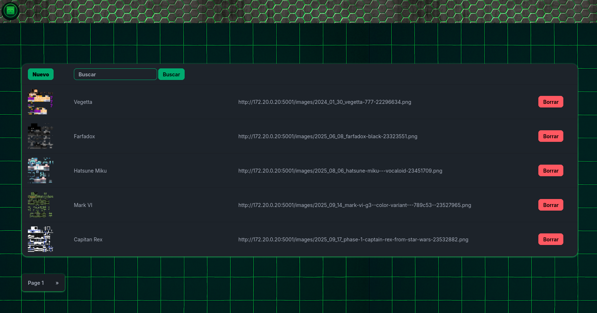

# PIG (Png Image Gestor)

Este microservicio es una pieza clave del stack del **proyecto Pana Gaming**, diseñada específicamente para gestionar las skins de Minecraft, con un enfoque principal en los **NPCs** del servidor oficial de **Minecraft Pana Gaming**.

Destaca por su interfaz intuitiva y facilidad de uso, permitiendo administrar skins de manera rápida y eficiente. Además, cuenta con una **API** robusta que facilita que los NPCs puedan obtener y mostrar las skins mediante peticiones HTTP, siguiendo el mismo flujo que siempre se ha utilizado en el servidor.

Como las demás piezas del proyecto, este microservicio está diseñado para integrarse en la red de contenedores **MC-BLOCK-NET**, formando lo que se denomina el **Bloque de Minecraft**: un ecosistema modular y escalable donde cada microservicio funciona de manera independiente pero se comunica perfectamente con los demás, garantizando la estabilidad y cohesión del servidor.

## Ayudame y apoya este proyecto!!

